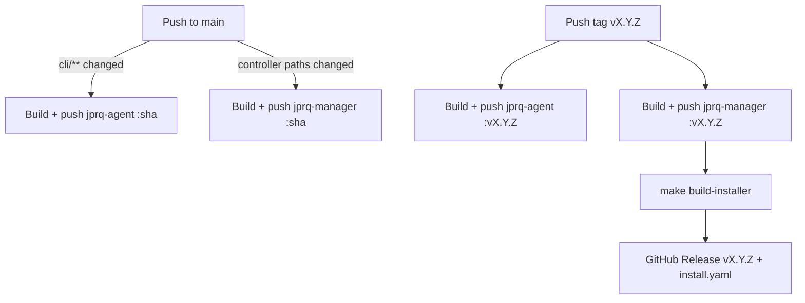

# CI: image builds & releases

Two workflows publish images to GHCR. Each only fires on changes to its own
component, and both always run (regardless of what changed) on a version tag.

| Workflow | Watches | Publishes |
|---|---|---|
| [`cli-image.yml`](../.github/workflows/cli-image.yml) | `cli/**`, `Dockerfile.agent` | `ghcr.io/muzaffarnurillaew/jprq-agent` |
| [`controller-image.yml`](../.github/workflows/controller-image.yml) | `cmd/**`, `internal/controller/**`, `internal/jprqconfig/**`, `api/**`, `Dockerfile`, `config/{crd,rbac,manager,default,network-policy}/**` | `ghcr.io/muzaffarnurillaew/jprq-manager` |

Docs, samples, and files like `.gitignore` aren't in either watch list, so
editing them never triggers a build.

## Tagging

- Push to `main` → image tagged with the short commit sha (e.g. `a1b2c3d`).
- Push a tag `vX.Y.Z` → both images are rebuilt and tagged `vX.Y.Z`, no matter
  which paths changed. Path filters are skipped on purpose here — a release
  must always ship fresh, matching images.

## Releasing

Pushing a `vX.Y.Z` tag also runs a `release` job (in `controller-image.yml`)
that renders `install.yaml` — via `make build-installer`, with both images
pinned to that tag — and attaches it to a GitHub Release. That gives users a
one-command install:

```
kubectl apply -f https://github.com/muzaffarnurillaew/jprq-bek/releases/download/vX.Y.Z/install.yaml
```

## Flow


