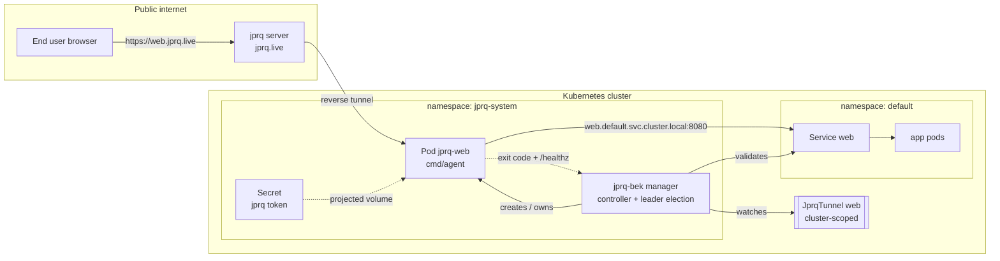
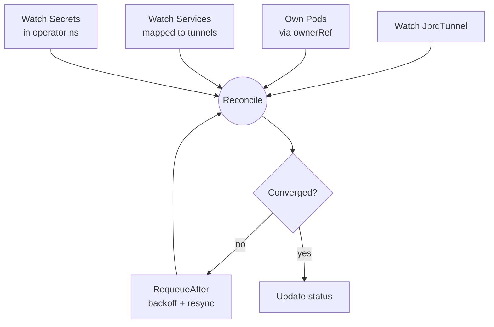
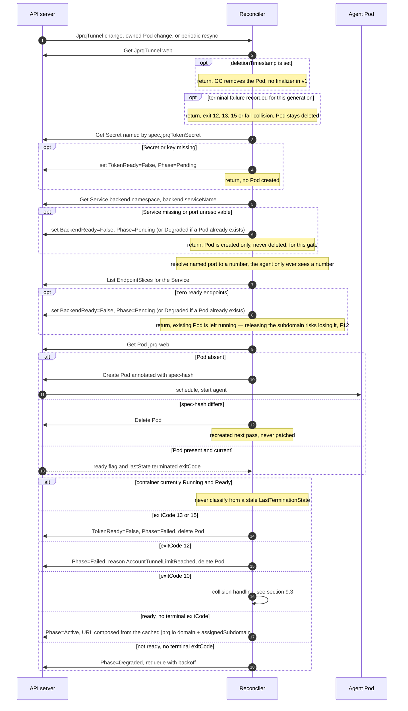
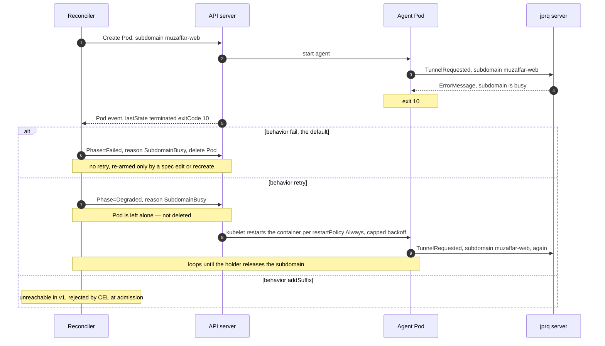

# JprqTunnel — Design Document

**Status:** Draft for review · **Version:** v1alpha1 · **Date:** 2026-09-19

A Kubernetes CRD + controller that exposes in-cluster Services to the public
internet through [jprq](https://jprq.io), the way `cloudflared` does for
Cloudflare Tunnel.

---

## 1. Goals and non-goals

### v1 goals

- A `JprqTunnel` resource that maps a public subdomain to a cluster Service:
  the declarative equivalent of `jprq http <port> -s <subdomain>`.
- Continuous reconciliation: the tunnel is restored after pod crashes, node
  drains, and transient jprq-server disconnects, with no human action.
- Honest, actionable status: a user can tell from `kubectl get jprqtunnel`
  whether the tunnel is live, and if not, exactly why.
- Graceful, explicit handling of jprq's two hard limits — **one holder per
  subdomain** and **4 concurrent tunnels per account**.

### v1 non-goals

| Deferred | Rationale |
|---|---|
| TCP tunnels (`jprq tcp`) | Public port is server-assigned and unpredictable, so the status/DNS story differs materially. The agent keeps a `JPRQ_PROTOCOL` knob so this is additive. |
| Cloudflare CNAME automation | API shape is settled in §5 so adding it is non-breaking; the controller ignores it in v1. See §11. |
| `subdomainCollisionBehavior: addSuffix` | Present in the schema, rejected at runtime in v1. See §9.3. |
| `jprq --debug` debugger | Binds a second local port and is a laptop-debugging affordance, not a cluster one. |
| Multi-tenancy guardrails | Explicitly accepted risk. See §12.2. |

---

## 2. Upstream facts that constrain this design

Every non-obvious decision below traces to one of these. All were read from
source at `~/programming/jprq`, not inferred.

| # | Fact | Source | Consequence |
|---|---|---|---|
| F1 | The client dials **`localhost:<port>` only** — `j.localServer = fmt.Sprintf("localhost:%d", port)`. The arg is parsed as a bare int; no host flag exists. | `cli/jprqc.go:54`, `cli/main.go:72` | A pod running the stock client cannot reach a Service. Forces §4. |
| F2 | **Never reconnects.** Any event-stream read error calls `log.Fatalf` → exit 1. | `cli/jprqc.go:75-77` | Process death is *routine*, not exceptional. Restart must come from kubelet. Drives §6.2. |
| F3 | **`MaxTunnelsPerUser = 4`**, `MaxConsPerTunnel = 24`. | `server/config/config.go` | Quota exhaustion is a terminal, user-resolved failure. Drives §10. |
| F4 | One tunnel per subdomain; a second request gets `subdomain is busy: %s, try another one` and the client exits. | `server/jprq.go:128-130` | Two pods can never overlap for one subdomain. Drives §6.1 and §9. |
| F5 | **All failures are exit code 1**, message on stderr only. No distinct codes. | `cli/jprqc.go:51` | Distinguishing "busy" from "auth failed" requires text matching — unless we own the binary. Drives §4 and §7.2. |
| F6 | `events.WriteError` has a bug: `fmt.Sprintf(message, args)` passes the variadic slice as one operand, so messages render with literal brackets — verified: `"subdomain is busy: [mysub], try another one"`. | `server/events/events.go:48-56` | Match on the **prefix before `%s`**, which is correct whether or not upstream fixes this. |
| F7 | Token path is `os.UserConfigDir()/jprq/.jprq-config`, i.e. `$XDG_CONFIG_HOME` or `$HOME/.config`, containing `{"auth_token":"..."}`. | `cli/config.go:24-33` | Relevant only for back-compat now; see §8.1. |
| F8 | Startup does `GET https://jprq.io/config.json`, then dials `event.jprq.live:4321`, then dials `jprq.jprq.live:<PrivateServer>` **per connection** on a server-assigned port. | `cli/config.go:37`, `cli/jprqc.go:27,55,90` | Egress cannot be pinned to a known port. Drives §12.3. |
| F9 | Subdomain rules are fully knowable up front: length 3–38, regex `^[a-z\d](?:[a-z\d]\|-[a-z\d]){0,38}$`, deny-list `{www, jprq}`. | `server/utils.go:11-44` | Enforceable in the OpenAPI schema → invalid specs rejected at `kubectl apply`, never as a crash-loop. |
| F10 | An undocumented `-c/--cname` flag exists; the server maps custom hostnames via `cnameMap`. | `cli/main.go:114`, `server/jprq.go:86-88,131-134` | jprq already *serves* custom hostnames. Cloudflare's only job is the DNS record. |
| F11 | `signal.Notify(signalChan, os.Interrupt)` — **SIGINT only**, no SIGTERM handler. | `cli/main.go:99` | Pod deletion relies on Go's default terminate. Our agent handles SIGTERM explicitly. |
| F12 | No subdomain-availability API and no list-tunnels API; `userTunnels` is in-memory server state with no endpoint. | `server/jprq.go:33` | Collision detection is necessarily **reactive**. We cannot pre-flight a subdomain. |

---

## 3. Architecture



Two planes, deliberately separated:

- **Control plane** — the manager. Reconciles desired state, owns no network
  traffic. Its failure degrades *change propagation*, not live tunnels.
- **Data plane** — one agent pod per tunnel. Holds the reverse connection.
  Its failure kills exactly one tunnel.

A live tunnel survives a manager crash, because the connection is held by the
agent pod and the kubelet restarts its container independently. That property is
why the agent is a separate binary rather than goroutines inside the manager —
with an in-manager data plane, a manager rollout would drop every tunnel at once.

---

## 4. The loopback problem, and why we own the agent binary

F1 is the pivotal constraint: `jprq http 8080` can only ever reach
`127.0.0.1:8080` inside its own network namespace. Three ways out were weighed:

| Option | Verdict |
|---|---|
| `socat` sidecar bridging `127.0.0.1:8080` → `web.default.svc:8080` | Works with zero custom code, but leaves F5 unsolved: failures stay indistinguishable behind exit 1, so collision handling degrades to regex-on-logs. |
| Fork `azimjohn/jprq` | Solves F1 and F5, but creates a second repo and image pipeline, and every upstream pull becomes a rebase. |
| **Own agent in this repo** ✅ | Solves F1 and F5 together, and lets us add the three things the controller actually needs: distinct exit codes, a readiness endpoint, and structured logs. |

**Decision:** `jprq-bek` ships its own `cmd/agent`. The client logic is ~110
lines (`cli/jprqc.go`), and the wire protocol lives in `server/events` +
`server/tunnel.Bind` — both exported, neither under `internal/`. We copy them
into `internal/jprq/` rather than taking a module dependency, so there is one
repo, one image, one place to read.

> **Coupling risk.** The protocol is `encoding/gob` over a raw TCP socket with a
> 2-byte length prefix — no version negotiation. If upstream changes a struct in
> `events`, our agent breaks at runtime with a decode error and no clear
> diagnostic. **Mitigation:** each copied file carries a header naming the
> upstream commit it was taken from, and `internal/jprq/` holds a round-trip
> encode/decode test so a drifted copy fails in CI rather than in a pod.
> Upstream is low-churn, which is what makes copying acceptable here.

### 4.1 Back-compatibility

The agent stays usable as a drop-in CLI: positional args and flags keep their
upstream meaning, env vars are only consulted as a *fallback*, and if no token
is supplied via file or env it falls back to the upstream path (F7). So
`./agent http 8080 -s mysub` behaves exactly like `jprq http 8080 -s mysub` on a
laptop, which keeps the container path debuggable outside the cluster.

---

## 5. API: `JprqTunnel`

`apiVersion: tunnel.jprq.io/v1alpha1` · `kind: JprqTunnel` · **cluster-scoped**

### 5.1 Why cluster-scoped, and what it costs

Chosen so `kubectl get jprqtunnel` is a complete cluster-wide inventory, and so
the jprq token exists in exactly one namespace and never needs copying. The cost
is real and accepted in v1: there is no namespace RBAC boundary on what can be
exposed (§12.2).

Pods live in `jprq-system`, never in the CR's namespace — there is no CR
namespace. This is legal Kubernetes ownership: **a namespaced dependent may
declare a cluster-scoped owner**, so garbage collection works normally. (The
disallowed shapes are cross-namespace refs, and a namespaced object owning a
cluster-scoped one — neither applies.) Cross-namespace Service reachability is
likewise a non-issue: ClusterIP DNS is cluster-wide.

### 5.2 Spec

```go
type JprqTunnelSpec struct {
    // +kubebuilder:validation:MinLength=3
    // +kubebuilder:validation:MaxLength=38
    // +kubebuilder:validation:Pattern=`^[a-z0-9](?:[a-z0-9]|-[a-z0-9]){2,37}$`
    Subdomain string `json:"subdomain"`

    // +kubebuilder:validation:Enum=fail;retry;addSuffix
    // +kubebuilder:default=fail
    SubdomainCollisionBehavior string `json:"subdomainCollisionBehavior,omitempty"`

    Backend BackendRef `json:"backend"`

    JprqTokenSecret SecretKeyRef `json:"jprqTokenSecret"`

    // v1: schema only, rejected at runtime.
    CNAME *CNAMESpec `json:"cname,omitempty"`
}

type BackendRef struct {
    Namespace   string             `json:"namespace"`
    ServiceName string             `json:"serviceName"`
    Port        intstr.IntOrString `json:"port"` // Service port name or number
}

type SecretKeyRef struct {
    Name string `json:"name"`          // Secret in the operator namespace
    // +kubebuilder:default=authToken
    Key  string `json:"key,omitempty"`
}

type CNAMESpec struct {
    Hostname              string       `json:"hostname"`
    CloudflareTokenSecret SecretKeyRef `json:"cloudflareTokenSecret"`
}
```

The `Pattern` is F9's regex transcribed. Combined with the length bounds and the
deny-list (enforced by CEL, §5.4), **every subdomain the API accepts is one the
jprq server will accept** — so `invalid subdomain` becomes structurally
impossible at runtime rather than a crash-loop to diagnose. This is the single
highest-value thing the schema does.

### 5.3 Example

```yaml
apiVersion: tunnel.jprq.io/v1alpha1
kind: JprqTunnel
metadata:
  name: web
spec:
  subdomain: muzaffar-web
  subdomainCollisionBehavior: fail
  backend:
    namespace: default
    serviceName: web
    port: http
  jprqTokenSecret:
    name: jprq-token
    key: authToken
```

### 5.4 CEL validation

```
// deny-list, from F9
self.subdomain != 'www' && self.subdomain != 'jprq'
// v1 only: addSuffix is schema-visible but unimplemented
self.subdomainCollisionBehavior != 'addSuffix'
// v1 only
!has(self.cname)
```

Rejecting unimplemented fields at admission — rather than accepting them and
silently ignoring them — means the two `// v1 only` rules can be deleted later
with no API break, and no user ever believes a feature is active when it isn't.

### 5.5 Status

```go
type JprqTunnelStatus struct {
    Phase              string  `json:"phase,omitempty"`   // Pending|Active|Degraded|Failed
    URL                string  `json:"url,omitempty"`     // https://<sub>.jprq.live
    AssignedSubdomain  string  `json:"assignedSubdomain,omitempty"`
    BackendAddress     string  `json:"backendAddress,omitempty"` // web.default.svc:8080, the resolved address the agent was actually given
    PodName            string  `json:"podName,omitempty"`
    LastExitCode       *int32  `json:"lastExitCode,omitempty"`
    LastFailureMessage string  `json:"lastFailureMessage,omitempty"`
    RestartCount       int32   `json:"restartCount,omitempty"`
    ObservedGeneration int64   `json:"observedGeneration,omitempty"`
    Conditions []metav1.Condition `json:"conditions,omitempty"`
}
```

**`BackendAddress`** (added in phase 2/3) holds the resolved `host:port` the
agent was actually started with, after the controller turns a named
`spec.backend.port` into a number. `BACKEND` needed as a printer column
(below), but a printer column's JSONPath cannot concatenate `spec.backend`'s
three fields into `ns/name:port`; the field also doubles as the answer to "what
did the agent actually dial", which otherwise requires reading the Pod's env.

`AssignedSubdomain` is distinct from `spec.Subdomain` from day one even though
v1 always sets them equal. It is where `addSuffix` will write its generated name
(§9.3), and introducing it now avoids a status migration later.

**Conditions** — `Ready`, `BackendReady`, `TokenReady`. Three independent causes
of not-working, each separately observable, so `Ready=False` is never the whole
story. `Phase` is a derived convenience for humans and printer columns;
conditions are the machine-readable truth.

**Terminal states are sticky.** `Phase=Failed` (exit 12, 13, 15, or a `fail`
collision) is cleared only by a change to `metadata.generation` — i.e. a real
spec edit — or by deleting and recreating the resource. Re-running
`kubectl apply` with *unchanged* YAML does **not** re-arm a failed tunnel,
because generation does not change. This is deliberate: it is what stops a
rejected token from crash-looping forever. See §10 for the recovery workflow.

**Printer columns:** `SUBDOMAIN`, `URL`, `BACKEND` (`.status.backendAddress`),
`PHASE`, `READY` (`.status.conditions[?(@.type=="Ready")].status`), `AGE`.

---

## 6. Data plane: the agent pod

### 6.1 Why a bare Pod, not a Deployment

`replicas` is a Deployment's reason to exist, and F4 pins it at 1 permanently.
What remains is pod-level lifecycle: node loss, eviction, and template
replacement. All three reduce to *"child is gone or stale → create it"*, a
branch the reconciler must implement regardless.

Against that, a Deployment would actively cost us two things:

- **Exit codes get further away.** §7.2 makes exit codes the collision-detection
  mechanism. From a named Pod that is one `Get`. Through Deployment → ReplicaSet
  → Pod it becomes a selector list, a multi-pod window to disambiguate, and
  `progressDeadlineSeconds` marking the Deployment failed for reasons unrelated
  to the tunnel.
- **We would have to disable the feature we're paying for.** `RollingUpdate` is
  fatal here: the new pod starts while the old still holds the subdomain, hits
  F4, and the rollout can never converge. We would be forced to set
  `strategy: Recreate` — i.e. pay for a Deployment and then switch off rolling
  updates, the only thing it was buying.

A bare Pod gives delete-before-create natively.

**Accepted loss:** while the manager is down, nothing recreates a pod lost to
node failure — a ReplicaSet would. Downtime then equals manager downtime,
bounded by leader-elected HA and acceptable for a dev-tunnel operator.

Container crashes — the *most common* event in this system, per F2 — are handled
identically by both options via `restartPolicy: Always`. The choice does not
affect the hot path at all.

### 6.2 Restart semantics

Per F2 the agent exits whenever the event stream drops, so `restartPolicy:
Always` *is* the reconnect mechanism. Deliberately, the agent does **not**
retry internally: keeping crash-and-restart as the only recovery path means
kubelet's `restartCount` and readiness remain truthful health signals, and
failures stay visible in `kubectl describe` instead of being hidden inside a
retry loop.

The cost is honest: CrashLoopBackOff backoff caps at 5 minutes, so an unlucky
transient blip can leave a tunnel down that long. Accepted for v1; if it bites
in practice, bounded in-agent retry *for network errors only* (never for exit
codes 10–15, which are terminal server verdicts) is the escape hatch.

### 6.3 Pod shape

```yaml
apiVersion: v1
kind: Pod
metadata:
  name: jprq-web
  namespace: jprq-system
  labels:
    app.kubernetes.io/name: jprq-agent
    jprq.io/tunnel: web
  annotations:
    jprq.io/spec-hash: "a1b2c3d4"       # §9.1
  ownerReferences:
    - apiVersion: tunnel.jprq.io/v1alpha1
      kind: JprqTunnel
      name: web
      controller: true
spec:
  restartPolicy: Always
  terminationGracePeriodSeconds: 5       # F11: no SIGINT handler upstream; ours exits fast
  automountServiceAccountToken: false    # the agent never calls the API server
  securityContext:
    runAsNonRoot: true
    runAsUser: 65532
    fsGroup: 65532                         # so the non-root container can read the token file below
    seccompProfile: { type: RuntimeDefault }
  containers:
    - name: agent
      image: ghcr.io/muzaffarnurillaew/jprq-bek-agent:v0.1.0   # §13
      env:
        - name: JPRQ_PROTOCOL
          value: http
        - name: JPRQ_BACKEND_HOST
          value: web.default.svc.cluster.local
        - name: JPRQ_BACKEND_PORT
          value: "8080"                  # always resolved to a number, §9.2
        - name: JPRQ_SUBDOMAIN
          value: muzaffar-web
        - name: JPRQ_TOKEN_FILE
          value: /etc/jprq/authToken
        - name: JPRQ_HEALTH_ADDR
          value: ":9000"
      volumeMounts:
        - name: token
          mountPath: /etc/jprq
          readOnly: true
      readinessProbe:                    # §7.3
        httpGet: { path: /healthz, port: 9000 }
        periodSeconds: 10
      securityContext:
        allowPrivilegeEscalation: false
        readOnlyRootFilesystem: true
        capabilities: { drop: ["ALL"] }
      resources:
        requests: { cpu: 10m, memory: 32Mi }
        limits:   { memory: 64Mi }
  volumes:
    - name: token
      secret:
        secretName: jprq-token
        items: [{ key: authToken, path: authToken }]
        defaultMode: 0440
```

Env vars rather than a ConfigMap, because the manager owns this pod spec
outright: inline values are covered by the spec-hash (§9.1), so a change
triggers pod replacement automatically. A ConfigMap would be a second object to
reconcile *and* would not restart the pod when it changed — strictly more
machinery for strictly less correctness. (Env vars still make the agent
ConfigMap-friendly for anyone running it by hand; that possibility is preserved,
just not used by the controller.)

---

## 7. Agent contract

This is the controller↔agent interface. It is the reason we own the binary.

### 7.1 Configuration

| Env var | Meaning |
|---|---|
| `JPRQ_PROTOCOL` | `http` in v1 |
| `JPRQ_BACKEND_HOST` | FQDN to dial — replaces upstream's hardcoded `localhost` (F1) |
| `JPRQ_BACKEND_PORT` | Numeric port |
| `JPRQ_SUBDOMAIN` | Requested subdomain |
| `JPRQ_CNAME` | Reserved, unset in v1 (F10) |
| `JPRQ_TOKEN_FILE` | Path to a file containing the raw token |
| `JPRQ_HEALTH_ADDR` | Health listener address |
| ~~`JPRQ_LOG_FORMAT`~~ | dropped — logs are always JSON, see §17.3 |

Precedence: flags > env > upstream config file (§4.1).

### 7.2 Exit codes

F5 is the problem this solves: upstream collapses every distinct failure into
exit 1, so a controller cannot tell "someone else has your subdomain" from "your
token is invalid" — one is retryable, the other never is. Matching stderr text
would work but couples the controller to server message strings.

| Code | Meaning | Upstream message prefix (F6) | Controller reaction |
|---|---|---|---|
| 0 | Clean SIGTERM shutdown | — | Expected during deletion |
| 1 | Unexpected error | — | `Degraded`, retry with backoff |
| 10 | Subdomain busy | `subdomain is busy:` | §9.3 collision state machine |
| 11 | CNAME busy | `cname is busy:` | `Failed`, terminal (v2) |
| 12 | Account tunnel limit | `tunnels limit reached for` | `Failed`, **terminal**, pod deleted — §10 |
| 13 | Auth failed | `authentication failed` | `TokenReady=False`, **terminal** |
| 14 | Invalid subdomain | `invalid subdomain` | `Failed`; should be unreachable given §5.2 |
| 15 | Not on allow-list | `jprq is now invite-only service` | `TokenReady=False`, terminal |
| 20 | Config/bootstrap failure | — | `Degraded`, retry — usually egress (F8) |
| 21 | Event server unreachable | — | `Degraded`, retry |
| 22 | Event stream dropped | — | Normal per F2; restart, not an error |

Matching is on the **prefix before the format verb**, which is why F6's bracket
bug is irrelevant: `subdomain is busy:` matches both the buggy
`subdomain is busy: [x], try another one` and a fixed version.

Codes 12, 13 and 15 are terminal by design: retrying a rejected token or an
exhausted account produces identical failures forever while burning restarts and
log volume. Only human action resolves them.

### 7.3 Health endpoint

`GET /healthz` returns 200 once `TunnelOpened` is received and the event loop is
running; 503 before that. Backed by an `atomic.Bool` set only after the server's
`TunnelOpened` comes back error-free, so readiness means "tunnel established",
not "process alive".

Bound to `:9000` — **all interfaces, not loopback.** An earlier draft specified
`127.0.0.1` on the reasoning that only the kubelet needs it. That was wrong: in
an `httpGet` probe the kubelet is the client and runs on the *node*, outside the
pod's network namespace, so a loopback-bound listener can never answer it and the
pod would never become Ready. The probe correspondingly omits `host`, letting the
kubelet default to the pod IP. This is not an exposure regression — the agent pod
has no Service, so the port is reachable only by pod IP from inside the cluster,
and the response carries no payload. `JPRQ_HEALTH_ADDR` can still be set to
`127.0.0.1:9000` for local testing.

This makes `status.Ready` derive from the kubelet's own `Pod.Ready`, rather than
from the controller inferring liveness — which it cannot do reliably, since a
running process is not a working tunnel and F12 leaves no way to ask the server.

### 7.4 Structured logs

One JSON object per event, so `status.URL` comes from the agent's authoritative
`TunnelOpened.Hostname` rather than by re-deriving it from spec:

```json
{"level":"info","event":"tunnel_opened","hostname":"muzaffar-web.jprq.live","protocol":"http"}
{"level":"error","event":"tunnel_failed","code":10,"message":"subdomain is busy: [muzaffar-web], try another one"}
```

### 7.5 Signals

SIGTERM and SIGINT both close the event connection and exit 0 (F11 handles only
SIGINT, relying on Go's default terminate for SIGTERM). Explicit handling makes
deletion a clean exit 0 rather than a signal-kill, so pod teardown is not
misread as a crash.

---

## 8. Secrets

### 8.1 Delivery: projected Secret file

The Secret is mounted at `/etc/jprq/authToken`, mode `0440` with `fsGroup: 65532`,
and the agent reads the raw token from that path (`JPRQ_TOKEN_FILE`). Because we
own the agent (§4), upstream's `{"auth_token":"..."}` file format (F7) is not a
requirement — the file holds the raw token and there is nothing to template.

Kubernetes Secret volume files are root-owned regardless of the pod's
`runAsUser`; only `fsGroup` gets the container's non-root user into the file's
group, and only a group-readable mode (`0440`, not `0400`) actually grants that
group read access. Discovered by running against a real kind cluster (`0400`
alone passed envtest, which never materializes real files, then failed with
`permission denied` under a real kubelet) — see §17.7.

**Why a file rather than `secretKeyRef` env** — you asked, so the honest version:

- An env var is readable from `/proc/<pid>/environ` by anything that can exec in
  the container, and is inherited by every child process. A group-readable file
  read once at startup has a narrower reach.
- Rotation takes effect on **container restart** instead of requiring pod
  replacement. Kubelet updates Secret volumes in place, and per F2 container
  restarts are routine — so a rotated token lands on the next restart. An env var
  is fixed for the pod's entire lifetime, so rotating it means deleting the pod.

And the claim that does **not** hold up, which I had implied earlier: env vars do
not leak through `kubectl describe pod` either — `secretKeyRef` shows only the
reference, never the value. That is not a differentiator between the two.

So this rests on two modest properties, not a security cliff. The cost is one
extra volume and a file read. If you would rather have the smaller pod spec,
`secretKeyRef` is a one-line change in the pod builder.

### 8.2 Token scope

`spec.jprqTokenSecret` is **required**, naming a Secret in `jprq-system`.

v1 assumes a single jprq account, so in practice every JprqTunnel names the same
Secret — the field will look redundant, and that is fine. It is required rather
than defaulted because per F3 the 4-tunnel cap is **per account**: the token is
the unit of quota, so which account a tunnel belongs to is load-bearing
information that should be written down at the call site rather than inherited
invisibly from manager config. Supporting multiple accounts later then becomes
purely a matter of pointing tunnels at different Secrets — no API change, no
defaulting rules to unwind, no migration.

---

## 9. Reconciliation

### 9.1 Trigger sources



Pod ownership is what makes this continuous rather than polling: a container
exiting produces a Pod status change, which the ownerRef turns into a reconcile
within milliseconds. The periodic resync is a safety net for missed events and
the driver of retry backoff — not the primary mechanism.

Convergence uses an **annotation spec-hash** over everything that affects the
pod: resolved backend host and port, subdomain, token Secret name and key, a
**SHA-256 digest of the token bytes**, protocol, and agent image. If the live
pod's hash differs, the pod is deleted and recreated — never patched, since a
Pod's env and args are immutable and F4 forbids overlap anyway.

The token digest is a deliberate addition beyond "Secret name and key": without
it, an in-place token rotation (same Secret, same key, new value) would never
change the hash, so the pod would keep running with the token it read at
startup and the rotation would be silently ignored. Only a digest of a
high-entropy token ever reaches the annotation — the same pattern as Helm's
`checksum/secret`.

### 9.2 Main loop



Ordering is deliberate. The terminal-failure check sits second, immediately after
deletion, so a tunnel with a rejected token or an exhausted account costs one
`Get` and nothing more — no Secret read, no Service read, no pod churn, no log
noise. Token and backend validation then precede pod creation so that a tunnel
which *cannot* work never starts an agent — because that agent would still
register with the jprq server and burn one of the four real account slots (§10)
on its way to failing.

Port resolution happens controller-side: `spec.backend.port` accepts a name or a
number, the controller reads the Service to resolve names, and the agent always
receives a number. The agent therefore needs no API access at all, which is what
permits `automountServiceAccountToken: false` (§6.3).

> Note: the controller resolves the **Service port**, and traffic goes to the
> ClusterIP, so `targetPort` remains the Service's business — kube-proxy handles
> it. We do not resolve Endpoints for traffic — but we do read EndpointSlices
> for readiness, next.

**`BackendReady` requires ≥1 ready EndpointSlice endpoint**, not just a Service
that exists and a port that resolves. This closes the open question in §17.7
about whether `/healthz` should also dial the backend — it doesn't need to,
because the controller's own readiness check now catches a backend with no
healthy pods without touching the agent.

The check is deliberately **asymmetric**: a backend with no ready endpoints
blocks *creating* a Pod, but never causes the controller to *delete* a running
one. Deleting releases the subdomain claim, and F12 means that claim might not
be won back. A backend that flaps to zero ready endpoints therefore surfaces as
`BackendReady=False` + `Phase=Degraded` with the Pod left running, not as a
lost tunnel.

**The exit-code classification only runs when the agent container is not
currently `Running` and `Ready`.** With `restartPolicy: Always`,
`LastTerminationState.Terminated` survives a successful restart, so reading it
unconditionally would judge a healthy, currently-working tunnel by a
termination from several restarts ago and wrongly mark it `Failed`.

**`status.url`** is composed by the manager, not read from the agent. §9.2
originally assumed the URL came from parsing a `tunnel_opened` log line — that
line does not exist; the agent prints an unstructured `Forwarded: ...` line to
stdout via `fmt.Printf` (`cli/jprqc.go`), and the hostname is server-assigned.
Instead, the manager lazily fetches `https://jprq.io/config.json` on first
need (mirroring the agent's own startup fetch, `cli/config.go`), caches the
domain for the process lifetime on success, and composes
`https://<assignedSubdomain>.<domain>`. A failed fetch never blocks Pod
creation — it only leaves `status.url` empty until the next successful
resync, since the URL is cosmetic and the tunnel works without it.

### 9.3 Collision handling (exit 10)

F12 rules out pre-flight checks, so collisions are discovered only by trying.



- **`fail`** (default) — `Phase=Failed`, `Ready=False`, reason
  `SubdomainBusy`, pod deleted, no retry. Only a spec change re-arms it. The
  right default: a taken subdomain usually means a typo or a real conflict with
  another tunnel, and silently retrying forever hides that.
- **`retry`** — stays `Phase=Degraded`, reason `SubdomainBusy`, and the
  **Pod is left running**. Retry is entirely `kubelet`'s job: `restartPolicy:
  Always` already retries with capped exponential backoff, and a container
  restart *is* a fresh subdomain claim attempt. The controller must not also
  delete-and-recreate the Pod for the same exit code — that would be two retry
  engines racing each other. (This replaces an earlier version of this section,
  which had the controller delete the Pod and requeue itself for `retry`.)
  Correct for intentional handover, e.g. replacing a laptop-run tunnel with a
  cluster one.
- **`addSuffix`** — schema-visible, **rejected by CEL in v1** (§5.4). When
  implemented it will generate `<base>-<5 chars>`, truncating `base` to keep the
  total ≤ 38 (F9), and pin it in `status.assignedSubdomain` so the public URL is
  stable across restarts.

> **OPEN-1:** When `addSuffix` lands, should the suffix be sticky (pinned in
> status, stable URL) or re-rolled per attempt (faster convergence if the
> generated name also collides)? Sticky is the better default for anything a
> human bookmarks; deferred with the feature.

---

## 10. Quota: fail fast, no gating

Per F3 each jprq account allows 4 concurrent tunnels, and per §8.2 the token is
the unit of quota. **v1 does not count, track, or gate this.** The 5th tunnel is
created like any other; its agent is rejected by the server, exits 12, and the
controller records a terminal failure:

```
Phase:   Failed
Ready:   False   reason=AccountTunnelLimitReached
Message: tunnels limit reached for [muzaffar]
```

The pod is deleted rather than left to crash-loop, so an over-quota tunnel costs
one failed pod and nothing ongoing.

### 10.1 Recovery is manual and explicit

1. `kubectl delete jprqtunnel <one-you-no-longer-need>`
2. Delete and re-create the failed one — `kubectl delete jprqtunnel <failed>`
   then re-apply.

Step 2 is not optional, and it is the sharp edge worth knowing about: per §5.5
terminal states clear only on a generation change, so **re-running
`kubectl apply` with unchanged YAML will not retry a failed tunnel.** Either
delete and recreate it, or edit the spec.

### 10.2 Why no gating

FIFO gating was designed and then dropped. The argument that killed it is F12:
the controller can only count tunnels *it* manages, so a tunnel you run from your
laptop on the same account consumes a real slot invisibly. A gate would therefore
report `QuotaAvailable=True`, admit a 4th tunnel, and watch it fail with exit 12
regardless — a second, sometimes-wrong opinion layered over the only authority
that actually knows, which is the jprq server. It could not even eliminate the
exit-12 path it existed to prevent.

Dropping it removes a slot counter, per-token grouping, deterministic tie-break
ordering, and slot-release-on-terminal-failure — plus the failure modes each of
those carries, such as a miscounted slot starving healthy tunnels.

**Accepted costs**, both deliberate:

- *Which* tunnel loses is decided by whichever agent reaches the server first, so
  a bulk `kubectl apply -f dir/` picks arbitrarily among the over-quota set. The
  outcome is at least reported per-tunnel, so it is visible rather than silent.
- A freed slot is not picked up automatically; a failed tunnel stays failed until
  someone recreates it. This is the direct price of the simplification, and it is
  why §16 lists re-arming as the first thing to revisit if it chafes.

---

## 11. Deferred: CNAME and Cloudflare

Per F10 jprq already *serves* custom hostnames via `-c/--cname`, so the
remaining work is purely the DNS record: a CNAME from `app.example.com` to
`<subdomain>.jprq.live`. Because that creates state outside the cluster, it is
the one feature that needs a **finalizer** — the record must be deleted when the
JprqTunnel is, and ownerRef GC cannot do that. v1 has no finalizer at all, which
is why deletion in §9.2 is a no-op beyond GC.

> **TLS caveat, to document loudly when this ships.** jprq terminates TLS with a
> certificate valid only for `*.jprq.live`. A direct CNAME from a custom domain
> therefore produces a hostname mismatch. It only works with Cloudflare
> **proxied** (orange-cloud) mode and origin SSL mode **Full**, *not* Full
> (strict). Cloudflare then presents its own certificate to the browser and
> forwards with `Host: app.example.com`, which jprq's `cnameMap` resolves
> (`server/jprq.go:86-88`). Unproxied grey-cloud records will fail TLS, and
> the CRD should reject or warn on that configuration.

---

## 12. Security and networking

### 12.1 Agent hardening

Non-root, read-only rootfs, all capabilities dropped, no service-account token
(§9.2 explains why none is needed), memory-limited. The agent's only inputs are
a token file and env vars; its only outputs are TCP connections. It is the most
exposed component in the system — it proxies arbitrary internet traffic — so it
gets the least privilege.

### 12.2 Accepted risk: no tenancy boundary

A cluster-scoped `JprqTunnel` referencing `{namespace, serviceName, port}` means
**anyone who can create one can publish any Service in any cluster namespace to
the internet**, including `kube-system`. `kubectl` RBAC on `JprqTunnel` is the
only control.

Accepted for v1. Mitigations available later, in rough order of cost: a
namespace opt-in label (`jprq.io/allow-tunnels=true`) checked by the controller;
a manager-flag namespace allowlist; or a namespaced CRD, which would restore the
boundary at the price of the single-token-location property that motivated
cluster scope in the first place (§5.1).

**Deployment guidance:** grant `create` on `jprqtunnels` only to cluster
administrators.

### 12.3 Required egress

| Destination | Purpose |
|---|---|
| `jprq.io:443` | `GET /config.json` at startup (F8) — a hard startup dependency; unreachable means exit 20 |
| `event.jprq.live:4321` | Control connection, plaintext gob |
| `jprq.jprq.live:<dynamic>` | One dial **per public connection**, server-assigned port (F8) |
| cluster DNS | Service FQDN resolution |

Per F8 the data port is assigned at runtime, so **a NetworkPolicy cannot pin
it** — an egress policy must allow all TCP to that host. Worth stating plainly
rather than shipping a policy that appears to constrain more than it does.

If the backend namespace has a default-deny ingress policy, it must additionally
allow ingress from `jprq-system`.

**The manager also needs egress to `jprq.io:443`**, separately from the agent's
own startup fetch above: it lazily calls `GET /config.json` to resolve the jprq
base domain for `status.url` (§9.2), cached for the process lifetime on
success. Unlike the agent's fetch, a failure here is non-fatal — it only leaves
`status.url` empty.

---

## 13. Repository layout

```
jprq-bek/
  cmd/
    manager/          controller entrypoint
    agent/            data plane, §7
  api/v1alpha1/       JprqTunnel types
  internal/
    controller/       reconciler, exit-code classification, collision handling
    jprq/             copied events + tunnel.Bind, §4
  config/             kubebuilder manifests, CRD, RBAC
  docs/DESIGN.md      this document
```

One Go module, two binaries, **two images**, both published to GitHub Container
Registry:

| Image | Contents | Exposure |
|---|---|---|
| `ghcr.io/muzaffarnurillaew/jprq-bek-manager` | controller only | cluster-internal, holds API-server credentials |
| `ghcr.io/muzaffarnurillaew/jprq-bek-agent` | agent only | proxies arbitrary internet traffic |

Separate rather than one image with subcommand dispatch, because the agent is the
system's only internet-exposed component (§12.1). A combined image would ship the
manager binary — and its API-server client code — inside that exposed pod, for no
benefit. Separate images keep the blast radius matched to the job, and let the
agent image stay minimal and distroless.

**Version skew**, which a single image would have made impossible, is handled by
construction rather than by convention:

- Both binaries are built from the same commit of the same module, and the
  exit-code contract of §7.2 is a shared Go constant in `internal/jprq`, not a
  number duplicated in two places. The two images are always released under the
  same tag.
- The manager does not guess the agent tag. It takes `--agent-image`, currently
  defaulting to the literal `ghcr.io/muzaffarnurillaew/jprq-bek-agent:v0.1.0`
  in `cmd/main.go` (baking in the exact digest via `-ldflags` at build time is
  the intended end state, not yet wired up). So overriding it for a canary,
  or for local testing, is an explicit, visible act rather than a guess.

  **Known gap:** unlike `IMG`, which the Makefile's `install`/`deploy` targets
  push into the manifest via `kustomize edit set image controller=${IMG}`,
  there is no equivalent kustomize wiring for `--agent-image` — it's a bare
  container arg, and kustomize's image transformer only rewrites `image:`
  fields, not args. `config/manager/manager.yaml` currently hardcodes
  `--agent-image=agent:latest` for local kind use; a real deployment needs a
  JSON6902 patch (or a generated arg) to point it at a real registry image.

---

## 14. Decision log

| # | Decision | Rejected alternative | Why |
|---|---|---|---|
| D-01 | Own agent in `cmd/agent`, upstream protocol copied to `internal/jprq` | socat sidecar; fork upstream | Solves F1 *and* F5 together; a sidecar leaves every failure as exit 1 |
| D-02 | Cluster-scoped CRD, pods in `jprq-system` | namespaced | Cluster-wide inventory; token lives in exactly one place. Cost in §12.2 |
| D-03 | Bare Pod | Deployment `replicas=1, Recreate` | F4 makes `replicas` dead weight and `RollingUpdate` unusable; exit codes are one `Get` away |
| D-04 | Projected Secret file at `/etc/jprq/authToken`, mode 0440 + `fsGroup: 65532` | `secretKeyRef` env; initContainer writing upstream's JSON; mode 0400 (blocked the non-root container from reading its own token) | Owning the agent removes F7's file-format requirement; file avoids `/proc/environ` and rotates on restart — §8.1 |
| D-05 | Exit codes 10–22 + `/healthz` + JSON logs | text-match stderr | F5/F6: decouples the controller from server message strings |
| D-06 | No in-agent reconnect | retry with backoff | Keeps `restartCount`/readiness truthful; 5-min backoff cap accepted (§6.2) |
| D-07 | No quota gating — exit 12 is terminal, recovery is manual | FIFO gating per token; validating webhook | F12 makes any gate unsound, since tunnels run outside the cluster are uncountable; the gate could not remove the exit-12 path anyway — §10.2 |
| D-08 | `collisionBehavior` default `fail` | `retry` | A busy subdomain is usually a typo or real conflict; retrying hides it |
| D-09 | Full subdomain rules in the OpenAPI schema | validate at runtime | F9 is fully knowable up front, so exit 14 becomes unreachable |
| D-10 | Validate + watch backend Service | trust DNS | A typo becomes a clear condition instead of silent 502s |
| D-11 | Inline env, no ConfigMap | ConfigMap | Covered by spec-hash; a ConfigMap change would not restart the pod |
| D-12 | CNAME in schema, rejected by CEL in v1 | ship it; omit it | Settles the API shape with no false impression it works |
| D-13 | No tenancy guardrail in v1 | namespace opt-in label | Explicitly accepted; documented in §12.2 |
| D-14 | Separate manager and agent images | one image, subcommand dispatch | A combined image would put the manager binary and its API-server client inside the internet-exposed pod; skew handled via shared constants + `--agent-image` — §13 |
| D-15 | Manager composes `status.url` from a cached `GET jprq.io/config.json` + `assignedSubdomain` | parse the agent's stdout for a `tunnel_opened` line | That log line does not exist (`cli/jprqc.go` prints an unstructured `Forwarded:` line); the URL is server-assigned and cosmetic, so a failed fetch must not block Pod creation — §9.2, §12.3 |
| D-16 | Retry for exit 10 (`collisionBehavior: retry`) is `kubelet`'s job; the controller never deletes the Pod for it | controller deletes + requeues on a timer | `restartPolicy: Always` is already a retry engine; deleting too would race it — §9.3 |
| D-17 | `BackendReady` requires the Service to exist, its port to resolve, **and** ≥1 ready EndpointSlice endpoint | Service + port resolution only | Closes the `/healthz`-dials-backend question without changing the agent — §9.2, §17.7. Deliberately asymmetric: never *deletes* a running Pod when endpoints drop to zero, since that would release the subdomain and F12 may not let it be won back |
| D-18 | Secrets RBAC is a cluster-wide `ClusterRole`, cache scoped to `jprq-system` | namespaced `Role` per backend namespace | Consistent with §12.2's accepted absence of a tenancy boundary; a namespaced Role would imply a boundary that doesn't exist — §17.7 |
| D-19 | Spec-hash includes a SHA-256 digest of the token bytes, not just the Secret name and key | hash name/key only | Without it, an in-place token rotation never changes the hash, so the agent keeps running with the token it read at startup — §9.1 |
| D-20 | Events emitted via `events.k8s.io/v1` (`recorder.EventRecorder`) for terminal failures, collisions, and Pod create/recreate | the deprecated core `record.EventRecorder`; no events | Terminal transitions are otherwise visible only in `status` and manager logs |

---

## 15. Open questions

| # | Question | Notes |
|---|---|---|
| OPEN-1 | `addSuffix`: sticky suffix or re-rolled per attempt? | §9.3, deferred along with the feature itself |

Resolved during review: API group `tunnel.jprq.io`, operator namespace
`jprq-system`, GHCR as the registry under owner `muzaffarnurillaew`, Go module
path `github.com/muzaffarnurillaew/jprq-bek`, `jprqTokenSecret` required with a
single-account assumption, `serviceName` in `spec.backend`, no quota gating, and
separate manager/agent images.

---

## 16. Phasing

| Phase | Content |
|---|---|
| 1 | `cmd/agent`: env config, `--host`, exit codes, `/healthz`, JSON logs. Testable standalone against a real jprq account, before any controller exists. |
| 2 | CRD types + schema/CEL validation + codegen. |
| 3 | Reconciler: token and backend validation, pod create/recreate via spec-hash, status and conditions. |
| 4 | Collision handling (`fail`, `retry`) + terminal exit-code classification. |
| 5 | envtest for the reconciler; kind e2e for a real tunnel. |
| 6 | Post-v1, roughly in order of likely demand: a re-arm path for terminal failures so §10.1 step 2 is not needed, `addSuffix`, CNAME + Cloudflare + finalizer, `jprq tcp`, tenancy guardrail. |

Phase 1 first because it is independently verifiable: the exit-code contract of
§7.2 is the foundation everything in phases 3–4 keys off, and it is far cheaper
to validate against a live jprq account from a terminal than through a
reconciler.

---

## 17. Implementation deltas (phase 1 complete)

Phase 1 is built and verified. Where the shipped code differs from the sections
above, **the code is authoritative** and this section records why.

### 17.1 Layout: `cli/`, not `cmd/agent/` + `internal/jprq/`

§13 specified `cmd/agent/` with vendored protocol code in `internal/jprq/`.
Shipped layout:

```
cli/
  main.go  jprqc.go  config.go     copied from upstream, minimally patched
  debugger/                        copied verbatim (see 17.4)
  jprq/
    events.go  events_test.go      verbatim upstream wire protocol
    bind.go                        Bind only, 22 lines
    exitcodes.go                   Exit* + ErrPrefix* constants, §7.2
```

Three reasons: `cmd/main.go` is the manager's entrypoint and nothing
manager-side had to move; mirroring upstream's own `cli/` layout keeps the copied
files directly diffable against upstream, which matters because F11 gives the
wire protocol no version negotiation; and `cli/jprq/` is deliberately **not**
under `internal/` so the controller can import `Exit*`/`ErrPrefix*` — the shared
constant block §13's version-skew argument depends on.

`exitCodeForServerError()` currently lives in `cli/jprqc.go`. It should move to
`cli/jprq/exitcodes.go`, next to the prefixes it matches on.

### 17.2 Copy-then-patch, not rewrite

The agent is upstream's CLI with minimal diffs, not a reimplementation. Measured
changed lines vs upstream: `config.go` 41, `main.go` 85, `jprqc.go` 107. Upstream
function and struct names, declaration order, and comment style are preserved.
Provenance is upstream commit `3c10e25`, MIT (Copyright (c) 2020 Azimjon
Pulatov) — note no `LICENSE` file exists in the current upstream checkout; it was
located via `git log --diff-filter=A -- LICENSE` at commit `7077672`. Each copied
file carries a provenance header.

The `WriteError` bug in `events.go` (F6) is **preserved deliberately**.
Classification matches the literal prefix before the format verb, so repairing it
would change the wire text we key on.

### 17.3 No `JPRQ_LOG_FORMAT`

§7.1 listed a log-format switch. Removed: logging is always JSON, implemented as
one line redirecting the stdlib `log` package through an slog JSON handler, which
left every upstream `log.Printf`/`log.Fatalf` call site untouched. The
human-facing `fmt.Printf` status block ("Status / Protocol / Forwarded") is not
logging and stays as-is.

### 17.4 Upstream subcommands and `--debug` retained

§1 scoped v1 to HTTP, and an earlier plan deleted `tcp`, `serve`, `auth`, and
`cli/debugger/`. Reversed, because upstream's help text advertises all of them and
keeping help identical is what makes the binary a genuine drop-in per §4.1.
HTTP-only is enforced by the *controller* only ever invoking `http`; it is not the
CLI's job to police.

**Cost, which qualifies §13's "minimal and distroless" claim:** copying
`cli/debugger/` added `github.com/djherbis/buffer` and
`github.com/djherbis/nio/v3` to `go.mod`, plus embedded static assets, all inside
the internet-exposed agent image. Still open whether that trade is worth it; the
alternative is dropping `debugger/` and deleting the two `--debug` lines from
`printHelp()`.

### 17.5 Configuration as shipped

Precedence is flags/positional args > env > upstream config file.

| Variable | Status |
|---|---|
| `JPRQ_PROTOCOL` | implemented (stands in for the command arg) |
| `JPRQ_BACKEND_HOST` | implemented — replaces upstream's hardcoded `localhost` (F1); empty falls back to `localhost` for laptop parity |
| `JPRQ_BACKEND_PORT` | implemented (stands in for the port arg) |
| `JPRQ_SUBDOMAIN` | implemented (fallback for `-s`) |
| `JPRQ_TOKEN_FILE` | implemented, with fallback to `~/.config/jprq/.jprq-config` per §4.1 |
| `JPRQ_HEALTH_ADDR` | implemented, default `:9000` (§7.3) |
| `JPRQ_CNAME` | **NOT implemented** — yet `exitcodes.go` documents `ExitCNAMEBusy = 11` as "unreachable in v1 (`JPRQ_CNAME` unset)", so the contract references a variable that does not exist |
| `JPRQ_DEBUG` | **NOT implemented** — `--debug` has no env alternative |

### 17.6 Build

`make build-cli` → `go build -o bin/agent ./cli`; `make run-cli`; `build-cli` is
wired into `all`. It depends on `fmt vet` only, not `manifests generate`, since
the CLI has no CRD codegen dependency. `bin/`, `testbin/`, and `Dockerfile.cross`
are gitignored — tool binaries are never committed, since versions are pinned in
the Makefile and `bin/controller-gen` is an absolute symlink that would dangle in
any other checkout.

### 17.7 Phase 2/3 deltas

- **Operator namespace fixed to `jprq-system`.** The scaffold's `namePrefix:
  jprq-bek-` in `config/default/kustomization.yaml` was the actual source of
  the namespace name (the Namespace object is literally named `system`), so
  both `namespace:` and `namePrefix:` had to change together — changing only
  `namespace:` would have created `jprq-bek-system` while placing resources in
  a `jprq-system` that no manifest defines.
- **Resolved:** should `/healthz` also TCP-dial the backend? No — left as
  shipped ("event stream established"), because `BackendReady` now separately
  requires ≥1 ready EndpointSlice endpoint (§9.2) before a Pod is even created,
  and a running Pod is deliberately never deleted for a backend that later
  drops to zero ready endpoints (§9.2's asymmetry, driven by F12). Pod-Ready
  still doesn't mean "works end to end" for reasons downstream of readiness
  (e.g. an app-level 500), but the common failure this question worried about —
  a backend with no healthy replicas — is now caught without touching the
  agent.
- **Secrets RBAC stays a cluster-wide `ClusterRole`** (read), consistent with
  §12.2's accepted absence of a tenancy boundary — a namespaced Role per
  backend namespace would imply a boundary that doesn't otherwise exist. The
  informer *cache* stays scoped to `jprq-system` only (`cmd/main.go`'s
  `cache.Options`), so this is not the same as watching every Secret in the
  cluster.
- **Events are emitted** via the `events.k8s.io/v1` recorder
  (`recorder.EventRecorder`, not the deprecated `record.EventRecorder`) for
  terminal failures, collisions, and Pod create/recreate — see §14 decision
  log.
- **Resolved:** the agent got its own `Dockerfile.agent` (mirrors the manager's
  `Dockerfile`, builds `./cli` instead of `cmd/main.go`), plus `make
  docker-build-agent`/`kind-load` targets and `--agent-image` wired into
  `config/manager/manager.yaml`, once a real kind run needed a runnable agent
  image. `.dockerignore` needed `!cli/debugger/static/**` re-included too —
  `cli/debugger/server.go`'s `go:embed` directives fail the build otherwise
  (only `*.go` files were re-included).
- **Found only by running against real kind, not envtest** (envtest has no
  kubelet and never materializes real container filesystems):
  - Both images need `imagePullPolicy: IfNotPresent` — the `:latest` tag
    otherwise defaults to `Always`, and kubelet tries (and fails) to pull from
    Docker Hub instead of using the image `kind load` already placed on the
    node.
  - The token Secret volume's mode 0400 left it unreadable by the non-root
    agent container — see D-04 and §8.1's rewrite.
- **End-to-end verification passed** against a real local kind cluster: CRD
  installed, manager deployed, a `JprqTunnel` created against a real jprq.io
  account reached `status.phase: Active` with a populated `status.url`, and
  the public URL reached a backend Pod running in the cluster. This closes the
  plan's last open verification item — the only remaining unautomated step is
  wiring the same flow into `test/e2e/`.
